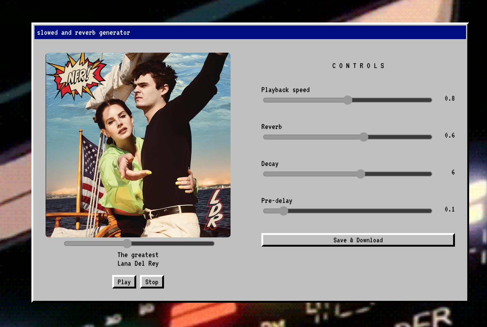

# Slowed and reverb songs generator
Have you ever listened to those [`slowed n reveb`](https://www.youtube.com/watch?v=dYX7EjF2bXk) songs in YouTube?
Well, you can make your own easily with this app.

>[ToneJS](https://tonejs.github.io/) was used to make this app work:

### How to run it?

1. Clone the repo
2. Run `yarn`
3. Run `yarn start`
4. Enjoy

### Settings Info
* **Playback rate**: Rate at which the song is being played back.
* **Reverb wet**: How much of the reverb will be applied to the song.
* **Reverb decay**: Duration of the reverb.
* **Pre-delay**: The amount of time before the reverb is fully ramped in.
